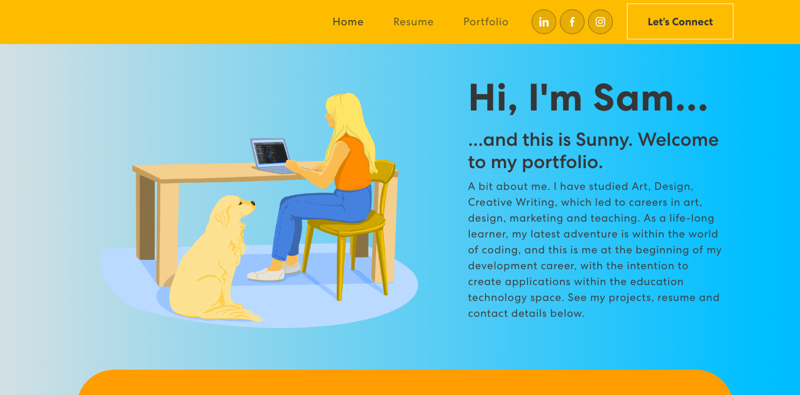

# Sam's Portfolio with React

# Description
A portfolio built using React and Bootstrap, featuring About, Resume, Projects and Contact sections.

## Image

## Links
GitHub: https://github.com/Samantha-Sokolis/sams-react-portfolio

Deployed application:

## Scripts

In the project directory, `npm start` runs the app in the development mode, and is viewed here [http://localhost:3000](http://localhost:3000) in the browser.

### `npm run build`

Builds the app for production to the `build` folder.

## Resources
https://react-bootstrap.github.io/components

https://create-react-app.dev/docs/deployment/#github-pages

https://reactjs.org/

This tutorial was used as a guide for this project: 
https://www.youtube.com/watch?v=hYv6BM2fWd8&list=PLXd5BiFs-yczzOljI6t3obaH2jQIWk-uU&index=19&t=1799s